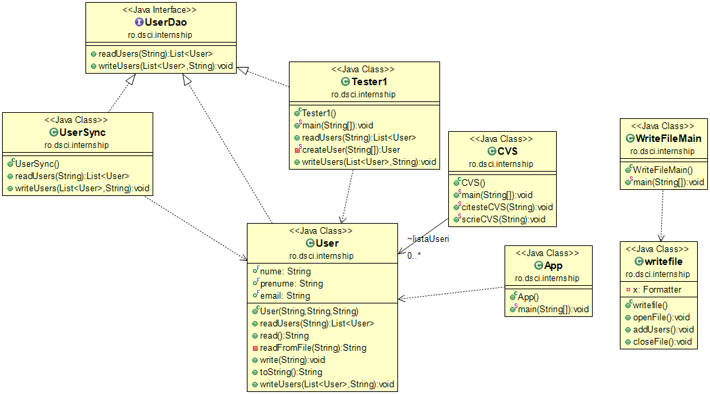

# DCSI - Internship Java for Enterprise Security

We document the project in [this wiki](https://github.com/raisercostin/dcsi/wiki).
Ask to be a collaborator if you want to contribute or make a pull request.

# Ship4

# Status
[](https://travis-ci.org/raisercostin/dcsi/team/ship4)
[](https://codeclimate.com/github/raisercostin/dcsi)

See [more tools at github.com marketplace](https://github.com/marketplace) and [more badges at shields.io](https://shields.io/)

This is the 4th practice session from September 2017

## Backlog
See [wiki](https://github.com/raisercostin/dcsi/wiki/UserSync-App-Backlog)

## Design



## Development

Usefull commands
- Keep formatting the same in the team. Execute these commands to format and then check style.
    ```
    mvn formatter:format
    mvn antrun:run
    mvn checkstyle:check
    mvn versions:display-plugin-updates
    ```

# Ship1, Ship2, Ship3

## Design
- 
- design changes - https://github.com/raisercostin/dcsi/commit/de94b0a04589716424836661bd8b259635c6410a?diff=unified
- current design
  
- design2
  
- design1
  

## Backlog

- prereq 
    - java installed 
        - to start idm server 

    - maven installed 
        - to have a prj with maven 

    - cmder installed for windows 
        - to be able to use curl like in bash 

    - git installed 
        - to have curl 

- check server 
    - install idm 
        - [~?https://www.forgerock.com/downloads/download-openidm-trial-downloading/ ](https://www.forgerock.com/downloads/download-openidm-trial-downloading/)
        - [~?https://backstage.forgerock.com/docs/idm/5/install-guide ](https://backstage.forgerock.com/docs/idm/5/install-guide)

    - check connection 
        - server 
            - [~?http://localhost:8080 ](http://localhost:8080/)
            - [~?https://localhost:8443 ](https://localhost:8443/)

        - user 
            - openidm-admin 

        - pass 
            - openidm-admin 

- What can be fixed from a security point of view? 
    - change the admin password 
    - change the admin username 
    - remove access via http 
    - use a secure connection 
        - add access via https 

- start a maven project 
    - [~?https://start.spring.io/ ](https://start.spring.io/)
    - maven-archetype-quickstart 
    - mvn archetype:generate 
        - options 
            - java8 
                - java8 
                - 7: remote -&gt; org.spilth:java8-junit4-quickstart 
                - 2 

            - quickstart 
                - maven-archetype-quickstart 

        - config 
            - groupId: ro.roweb.dcsi 
            - artifactId: intern 
            - version: 1.0-SNAPSHOT 
            - package: ro.roweb.dcsi 

    - choose the best generated one 
        - compare via totalcmd 
            - folders 
            - files 
            - change some 

    - generate eclipse project for maven 
    - import project in eclipse 
    - stake on ide wars 
        - eclipse 
        - IntelliJ IDEA 
        - netbeans 

- start adding git versioning 
- Import 100 users from a csv file. 
    - Project built with maven. 
    - Make a test with junit that checks user creation. 
    - Make test pass. 
    - csv library 
        - [~?stackoverflow.com &gt; Questions &gt; 10462507 &gt; Any-good-library-to-read-and-write-csv-files ](http://stackoverflow.com/questions/10462507/any-good-library-to-read-and-write-csv-files)

- Export 100 users to a csv file. 
- What if we have 1 000 000 users? 
- Add cli client. A console with some parameters. 
- steps 
    - GET http 
        - +HTTP 
            - app security 
                - user 
                    - identity 
                    - authentication 
                    - authorization 

            - infrastructure security 
                - PKI arhitecture 
                - SSL 
                - TLS 

    - GET REST json 
        - +JSON 
        - +REST 

    - PUT/CREATE 
        - +refactor 

    - CRUD SWAGGER 
        - YML 
        - as document 
        - as client 
        - as server 

    - HATEOAS 
        - [~?https://spring.io/understanding/HATEOAS ](https://spring.io/understanding/HATEOAS)
        - [~?https://martinfowler.com/articles/richardsonMaturityModel.html?](https://martinfowler.com/articles/richardsonMaturityModel.html)
